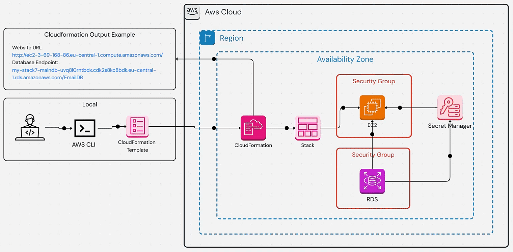
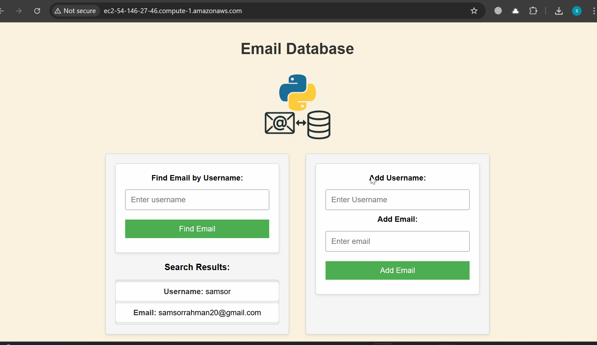
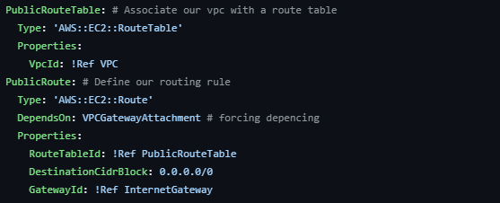

# cloudformation-april2025
Deploying a Flask Email Database on AWS with CloudFormation: A Step-by-Step Guide

## PROJECT DESCRIPTION


If you’re looking to deploy a web application with a database on AWS without breaking a sweat, this guide is for you. We’ll walk through automating the deployment of a simple Flask-based email database application using AWS CloudFormation. This app lets users add and retrieve email addresses, with the backend powered by AWS RDS and secrets stored securely in AWS Secrets Manager. Let’s dive in with a clear, hands-on approach to get this up and running.

### Demo


### 1-  Deploy Our Network Template  
* we will add SSH to our Security Group in the template that was provided


```
aws cloudformation create-stack --stack-name my-stack --template-body file://CFN-Template.yaml --region <your-region> --capabilities CAPABILITY_IAM
```

# STEPS BY STEPS PROCESS 

### 1. Launched 3 amazon linux 2 and 2 ubuntu server:


### 2. Installed ansible on linux-ansible-controller:


### 3. Verified ansible is installed in linux-ansible-controller. And generated ssh key-pair. Copied the public key to all 4 nodes:


### 4. Updated “hosts” file in ansible-controller.


### 5. Test the connectivity in-between the controller and nodes:


### 6. Run ansible-hw-playbook.yml file


### 7. Connect to linux-node1 i.e. “ansible-linux-node1” and verify that index.html file is written in /var/www/html


### 8. Connect to ubuntu-node1 i.e. “ansible-node1” and verify that index.html file is written in /var/www/html


### 9. Verify GIT is installed in both linux and ubuntu nodes:


